# TaintEMU-VMI User Guide

> TaintEMU: Decoupling Tracking from Functional Domains for Architecture-Agnostic and Efficient Whole-System Taint Tracking


## Quick Example

### 1. Prepare necessaries

First, create a directory named `xtaint`, and place `TaintEMU-VMI` inside this directory. Next, prepare a guest machine image (for example, an ARM architecture with a Debian system) and place it in the `dqib-arm64-virt` subdirectory of `xtaint`.

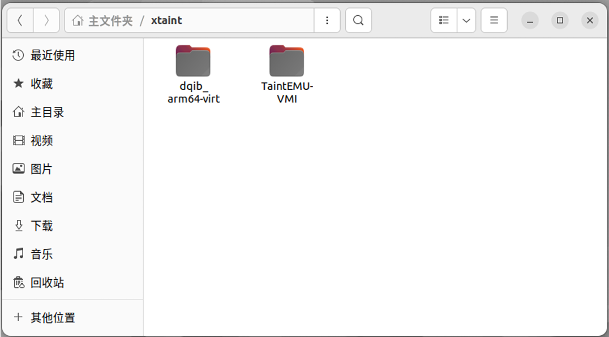

As shown in Figure 1-1, after extraction, the `xtaint` directory contains two folders: `dqib-arm64-virt` and `TaintEMU-VMI`. The `dqib-arm64-virt` folder contains the aarch64 architecture Debian system and its configuration files, while the `TaintEMU-VMI` folder contains all the source code for the tool.

### 2. Install QEMU Compilation Dependencies

On Ubuntu 22.04, run the following commands:

```shell
sudo apt update
sudo apt install build-essential ninja-build make git bison flex gawk libpixman-1-dev libsdl2-dev libslirp-dev python3 python3-pip rlwrap socat 

pip3 install meson
```

Note: Make sure to add `~/.local/bin` to your `PATH` to use `meson`.

### 3. Compile TaintEMU-VMI

Navigate to the `xtaint/TaintEMU-VMI` folder and run the following commands:

```shell
mkdir build
cd build
../configure --target-list=aarch64-softmmu --enable-sdl --enable-taint-engine
make -j8
```

After compilation, the directory will contain the executable file `qemu-system-aarch64`.

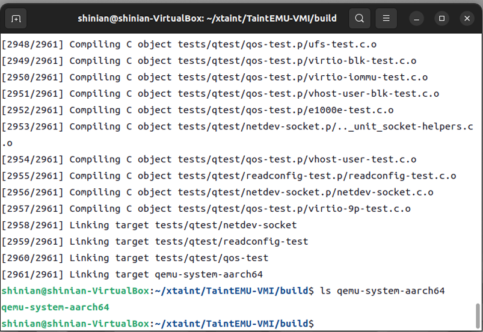

As shown in Figure 1-2, after compilation, the directory contains the executable file `qemu-system-aarch64`.

### 4. Use TaintEMU-VMI to Start the aarch64 Architecture Debian System

#### 4.1 Start TaintEMU-VMI

Open a new terminal (Terminal 1) and navigate to the `xtaint/dqib_arm64-virt` folder, then run:

```shell
./start_x_taint.sh
```

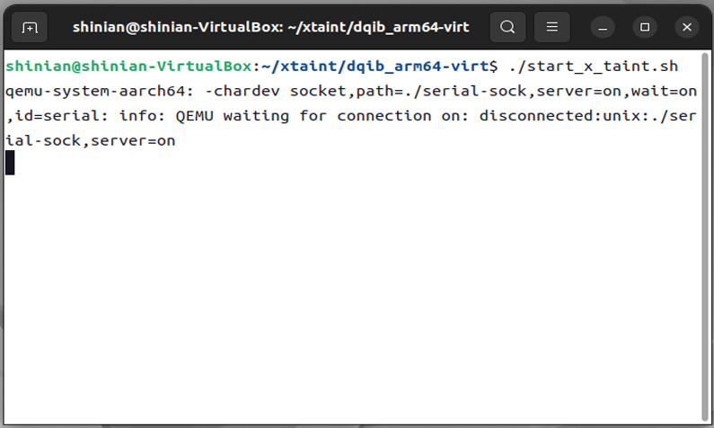

As shown in Figure 1-3, TaintEMU-VMI has started successfully.

#### 4.2 Connect to the Emulated USB Serial Port

Open another terminal (Terminal 2), navigate to the `xtaint/dqib_arm64-virt` folder, and run:

```shell
./serial.sh
```

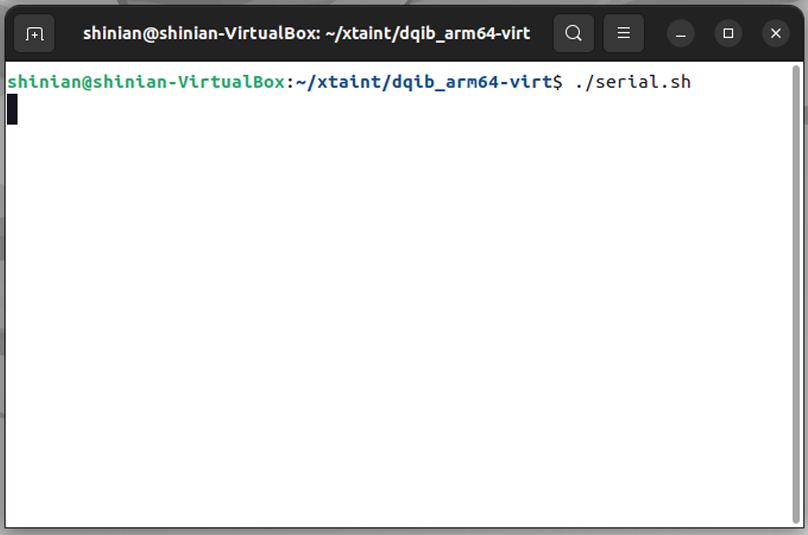

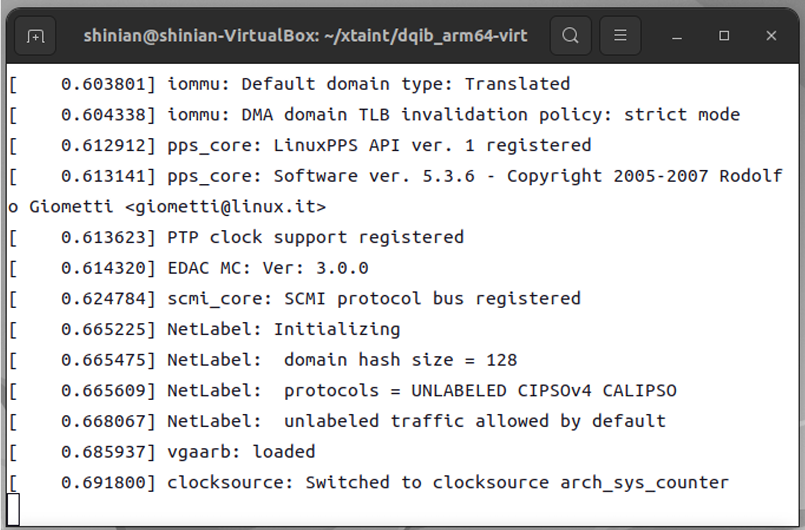

After connecting to the serial port, `TaintEMU-VMI` runs the Debian operating system.

### 5. Communicate with TaintEMU-VMI Using QMP Protocol

Open another terminal (Terminal 3), navigate to the `xtaint/dqib_arm64-virt` folder, and run:

```shell
./qmp.sh
```

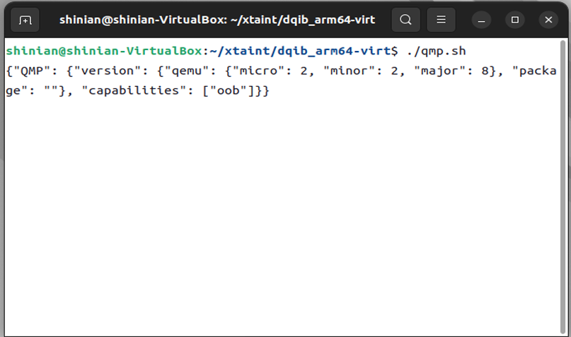

After successfully connecting via QMP, Terminal 3 will display a response from `QEMU`.

### 6. Configure Virtual Machine Self-Inspection

#### 6.1 Retrieve the Kernel Symbol Table

Wait for the Debian operating system to boot completely until the login prompt appears.

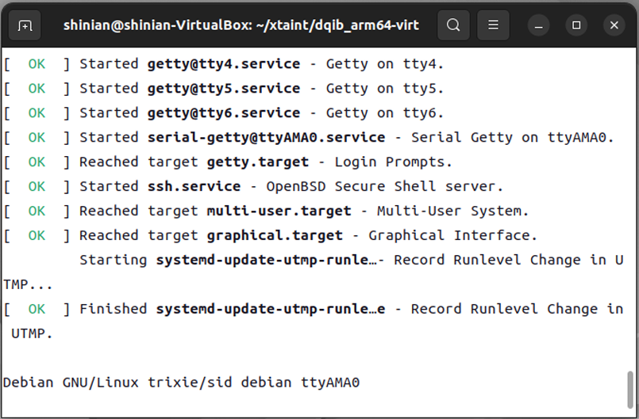

Open another terminal (Terminal 4), navigate to the `xtaint/dqib_arm64-virt` folder, and run:

```shell
python3 copy_out_sysmap.py
```

Once you see the message `done.`, the kernel symbol table has been copied to the host machine.

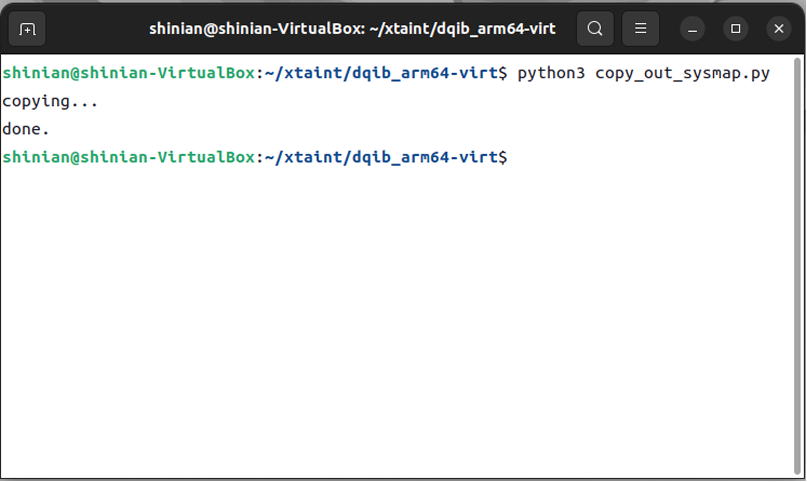

#### 6.2 Set Up Virtual Machine Self-Inspection for TaintEMU-VMI

In Terminal 3, run the following commands:

```shell
{ "execute": "qmp_capabilities" }
{ "execute": "setup-vmi", "arguments":{"path":"config.json"} }
```

After executing these commands, the virtual machine self-inspection will be successfully configured.

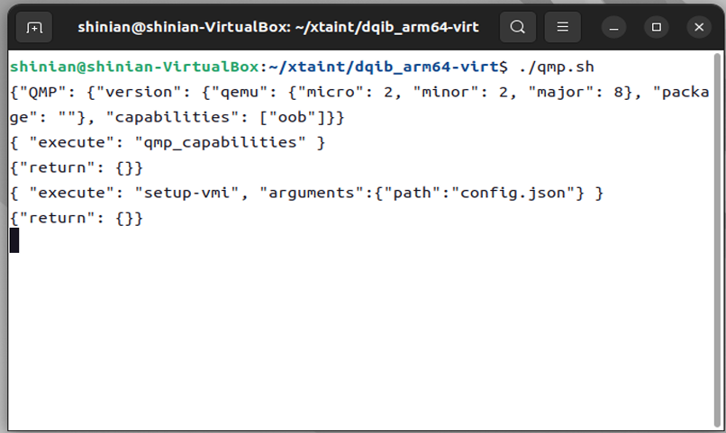

### 7. Test Virtual Machine Self-Inspection Functionality

In Terminal 3, run the command:

```shell
{ "execute": "x-ray-ps" }
```

The current list of running processes will be returned, indicating that the self-inspection function is working properly.

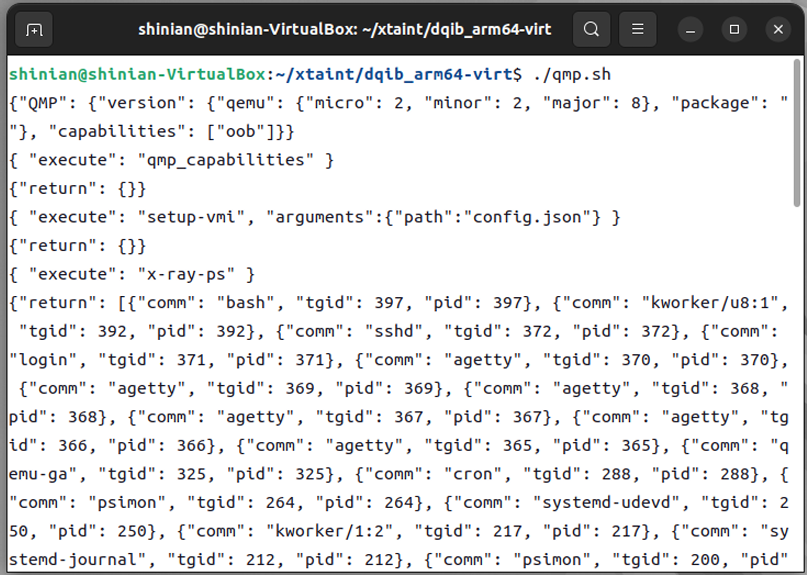

### 8. Test Dynamic Information Flow Tracking Functionality

#### 8.1 Log in as Root User in Terminal 1 and Read USB Serial Port Input Data

Log in as the root user:

```plaintext
Username: root
Password: root
```

Run the following command:

```shell
cat /dev/ttyUSB0 | grep hello
```

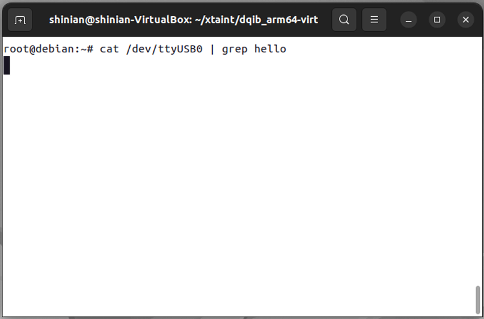

#### 8.2 Input Data from Serial Port and Track It

In Terminal 2, type:

```shell
hello,world
```

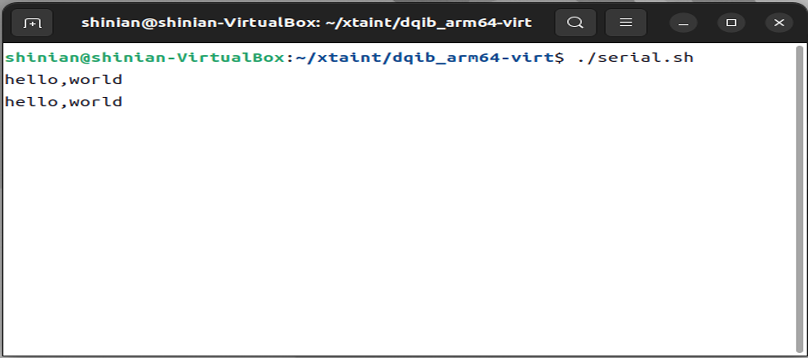

Terminal 1 will echo the tracking information.

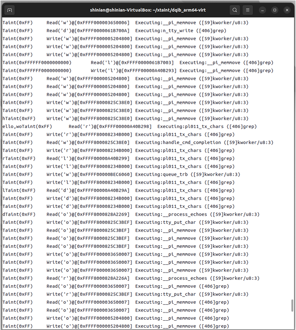

This concludes the example.

## Feature Overview

TaintEMU-VMI is a QEMU-based dynamic information flow tracking tool that provides high-performance and high-compatibility tracking capabilities across various instruction sets. The functionality consists of two main modules: virtual machine self-inspection and dynamic information flow tracking.

The virtual machine self-inspection feature follows an event-driven programming model based on the publish-subscribe pattern. The event source is function call events, and users need to register the corresponding event handler functions as needed. The dynamic information flow tracking functionality includes a series of interfaces for reading and writing tracking labels, as well as callback functions for label read and write operations, which users can utilize as needed to achieve dynamic information flow tracking.

## Programming Interfaces

### Virtual Machine Self-Inspection Functionality

Use the following in the `TaintEMU-VMI/x-ray/callback.c` file.

```c
int x_ray_add_kernel_hook (const char *name, xray_callback_t cb);
```

**Description**: Set a hook function based on the function name; when the guest executes the kernel function "name", the callback function `cb` is called.

**Parameters**:
- `@name`: The name of the kernel function.
- `@cb`: The callback function.

```c
int x_ray_add_process_hook (TVM_task_struct *task, uint64_t ptr, xray_callback_t cb);
```

**Description**: Set a hook function based on the process descriptor and process memory address; when the guest executes the process described by `task` and reaches the address `ptr`, the callback function `cb` is called.

**Parameters**:
- `@task`: The process descriptor.
- `@ptr`: The process instruction address.
- `@cb`: The callback function.

```c
TVM_task_struct* x_ray_get_current_task (CPUState *cpu);
```

**Description**: Return the process descriptor running on the specified CPU based on CPU information.

**Parameters**:
- `@cpu`: The specified CPU.

### Dynamic Information Flow Tracking Functionality

1. **Label Data Read/Write Interfaces**

Include the header file:

```c
#include "exec/cpu_ldst.h"
```

```c
uint32_t cpu_ldub_taint(CPUArchState *env, abi_ptr ptr); 
int cpu_ldsb_taint(CPUArchState *env, abi_ptr ptr); 
uint32_t cpu_lduw_be_taint(CPUArchState *env, abi_ptr ptr); 
int cpu_ldsw_be_taint(CPUArchState *env, abi_ptr ptr); 
uint32_t cpu_ldl_be_taint(CPUArchState *env, abi_ptr ptr); 
uint64_t cpu_ldq_be_taint(CPUArchState *env, abi_ptr ptr); 
uint32_t cpu_lduw_le_taint(CPUArchState *env, abi_ptr ptr); 
int cpu_ldsw_le_taint(CPUArchState *env, abi_ptr ptr); 
uint32_t cpu_ldl_le_taint(CPUArchState *env, abi_ptr ptr); 
uint64_t cpu_ldq_le_taint(CPUArchState *env, abi_ptr ptr); 
void cpu_stb_taint(CPUArchState *env, abi_ptr ptr, uint32_t val); 
void cpu_stw_be_taint(CPUArchState *env, abi

_ptr ptr, uint32_t val); 
void cpu_stl_be_taint(CPUArchState *env, abi_ptr ptr, uint32_t val); 
void cpu_stq_be_taint(CPUArchState *env, abi_ptr ptr, uint64_t val); 
void cpu_stw_le_taint(CPUArchState *env, abi_ptr ptr, uint32_t val); 
void cpu_stl_le_taint(CPUArchState *env, abi_ptr ptr, uint32_t val); 
void cpu_stq_le_taint(CPUArchState *env, abi_ptr ptr, uint64_t val); 
```

The interfaces are used similarly to native CPU interfaces. For usage details, refer to the [QEMU API Documentation](https://www.qemu.org/docs/master/devel/index-api.html).

2. **Callback Interfaces**

Use the following in the `TaintEMU-VMI/accel/tcg-taint.c` file.

```c
void taint_write_notify (uint64_t addr, uint64_t taint, uint64_t val, CPUArchState *env);
```

**Description**: Callback function when marking data is written to memory.

**Parameters**:
- `@addr`: The address of the memory being written to.
- `@taint`: The label value.
- `@val`: The value being written.
- `@env`: The guest environment variable.

```c
void taint_read_notify (uint64_t addr, uint64_t taint, uint64_t val, CPUArchState *env);
```

**Description**: Callback function when marking data is read from memory.

**Parameters**:
- `@addr`: The address of the marked data in memory.
- `@taint`: The label value.
- `@val`: The value being read.
- `@env`: The guest environment variable.

```c
void taint_exec_notify (uint64_t addr, uint64_t taint);
```

**Description**: Callback function when marking data is executed.

**Parameters**:
- `@addr`: The address of the marked data in memory.
- `@taint`: The label value.
- `@val`: The instruction value.
- `@env`: The guest environment variable.