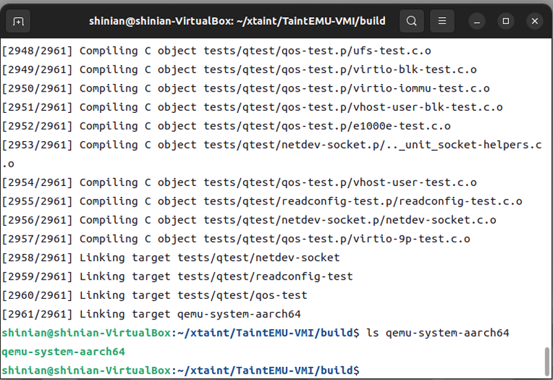
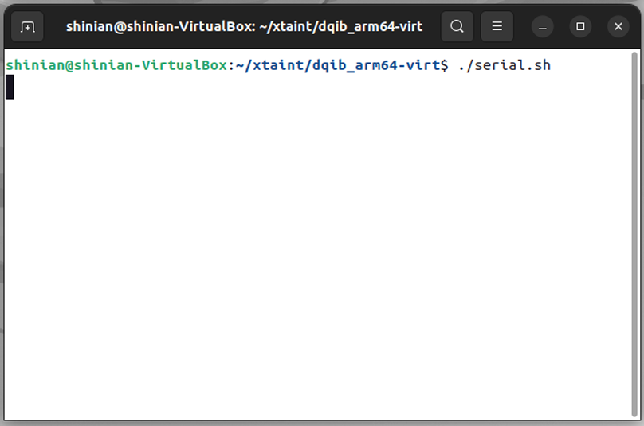
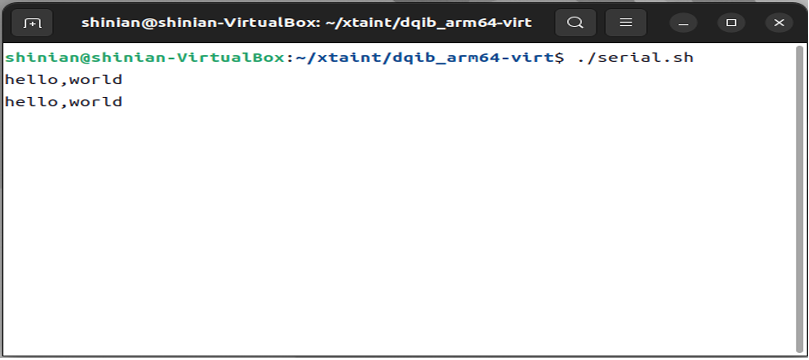
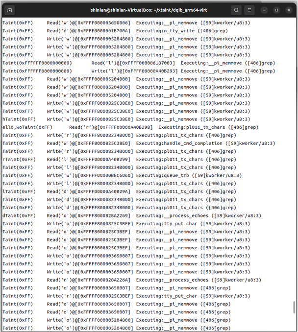

# TaintEMU-VMI 使用说明

## 快速示例

### 1. Prepare necessaries

首先创建`xtaint`目录，将`TaintEMU-VMI`放到该目录下面；准备客户机镜像（如arm架构，debian系统），放到`xtaint`目录的`dqib-arm64-virt`下面。


如图1-1所示，`xtaint`目录下得到两个文件夹，`dqib-arm64-virt`和`TaintEMU-VMI`。`dqib-arm64-virt` 文件夹中包含 `aarch64` 体系结构 `Debian` 系统 及其配置文件，`TaintEMU-VMI`文件夹包含工具所有源码。

### 2. 安装 QEMU 编译依赖

在 Ubuntu 22.04 系统上依次输入以下命令：
```shell
sudo apt update
sudo apt install build-essential ninja-build make git bison flex gawk libpixman-1-dev libsdl2-dev libslirp-dev python3 python3-pip rlwrap socat 

pip3 install meson
```
注意需要将 `~/.local/bin` 添加到 `PATH`，以使用 `meson`。

### 3. 编译 TaintEMU-VMI

进入 `xtaint/TaintEMU-VMI` 文件夹，依次输入以下命令：
```shell
mkdir build
cd build
../configure --target-list=aarch64-softmmu --enable-sdl --enable-taint-engine
make -j8
```

编译完毕后目录下会有 `qemu-system-aarch64` 可执行文件。



如图1-2所示，编译完毕后目录下会有qemu-system-aarch64可执行文件。 

### 4. 使用 TaintEMU-VMI 启动 aarch64 体系结构 Debian 系统

#### 4.1 启动 TaintEMU-VMI

新建终端（终端 1）进入 `xtaint/dqib_arm64-virt` 文件夹，输入以下命令：
```shell
./start_x_taint.sh
```


如图1-3所示，TaintEMU-VMI启动成功。

#### 4.2 连接模拟 USB 串口

新建终端（终端 2），进入 `xtaint/dqib_arm64-virt` 文件夹，输入以下命令：
```shell
./serial.sh
```




连接串口后，`TaintEMU-VMI `运行 `Debian` 操作系统。

### 5. 使用 QMP 协议与 TaintEMU-VMI 通信

新建终端（终端 3），进入 `xtaint/dqib_arm64-virt` 文件夹，输入以下命令：
```shell
./qmp.sh
```


QMP 连接成功后，终端 3 会显示 `QEMU` 回应。

### 6. 配置虚拟机自省

#### 6.1 获取内核符号表

等待 Debian 操作系统启动完毕，出现 login 提示。


新建终端（终端 4），进入 `xtaint/dqib_arm64-virt` 文件夹，输入以下命令：
```shell
python3 copy_out_sysmap.py
```

当出现 `done.` 字样后，内核符号表即拷贝至宿主机。


#### 6.2 为 TaintEMU-VMI 设置虚拟机自省

在终端 3 中依次输入以下命令：
```shell
{ "execute": "qmp_capabilities" }
{ "execute": "setup-vmi", "arguments":{"path":"config.json"} }
```

执行上述命令后，虚拟机自省即配置成功。


### 7. 测试虚拟机自省功能

在终端 3 中输入以下命令：
```shell
{ "execute": "x-ray-ps" }
```

返回当前系统中运行进程，则代表自省功能正常。


### 8. 测试动态信息流跟踪功能

#### 8.1 在终端 1 中登录 root 用户，读取 USB 串口输入数据

登录 root 用户：
```shell
用户名： root
密码： root
```

输入以下命令：
```shell
cat /dev/ttyUSB0 | grep hello
```


#### 8.2 从串口输入数据，并跟踪数据

在终端 2 中输入：
```shell
hello,world
```



终端 1 中会回显跟踪信息。



至此示例完毕。

## 功能介绍

TaintEMU-VMI 是一种基于 QEMU 的跨指令集动态信息流跟踪工具，其提供支持多种指令集的高性能、高兼容性的动态信息流跟踪功能，功能模块包含两部分，分别为虚拟机自省与动态信息流跟踪。

虚拟机自省功能遵循事件驱动的编程模型，即发布-订阅模式。事件源为函数调用事件，用户需要按需注册对应的事件处理函数。动态信息流跟踪功能主要包含一系列跟踪标签读写接口，以及标签读写回调函数，用户需要按需使用这些接口完成动态信息流跟踪功能。

## 编程接口

### 虚拟机自省功能

请于 `TaintEMU-VMI/x-ray/callback.c` 文件下使用。

```c
int x_ray_add_kernel_hook (const char *name, xray_callback_t cb);
```

功能描述：根据函数名设置倒钩函数，当客户机执行至“name”内核函数处调用 cb 回调函数。

参数描述：
- `@name` ：内核函数名。
- `@cb` ：回调函数。

```c
int x_ray_add_process_hook (TVM_task_struct *task, uint64_t ptr, xray_callback_t cb);
```

功能描述：根据进程描述符以及进程内存地址设置倒钩函数，当客户机执行至 task 描述的进程，并且执行至 ptr 位置时调用 cb 回调函数。

参数描述：
- `@task` ：进程描述符。
- `@ptr` ：进程指令地址。
- `@cb` ：回调函数。

```c
TVM_task_struct* x_ray_get_current_task (CPUState *cpu)
```

功能描述：根据 CPU 信息返回运行于此 CPU 上的进程描述符。

参数描述：
- `@cpu` ：指定 CPU。

### 动态信息流跟踪功能

1. **标签数据读写接口**

使用时请引入头文件：
```c
#include "exec/cpu_ldst.h"
```

```c
uint32_t cpu_ldub_taint(CPUArchState *env, abi_ptr ptr); 
int cpu_ldsb_taint(CPUArchState *env, abi_ptr ptr); 
uint32_t cpu_lduw_be_taint(CPUArchState *env, abi_ptr ptr); 
int cpu_ldsw_be_taint(CPUArchState *env, abi_ptr ptr); 
uint32_t cpu_ldl_be_taint(CPUArchState *env, abi_ptr ptr); 
uint64_t cpu_ldq_be_taint(CPUArchState *env, abi_ptr ptr); 
uint32_t cpu_lduw_le_taint(CPUArchState *env, abi_ptr ptr); 
int cpu_ldsw_le_taint(CPUArchState *env, abi_ptr ptr); 
uint32_t cpu_ldl_le_taint(CPUArchState *env, abi_ptr ptr); 
uint64_t cpu_ldq_le_taint(CPUArchState *env, abi_ptr ptr); 
void cpu_stb_taint(CPUArchState *env, abi_ptr ptr, uint32_t val); 
void cpu_stw_be_taint(CPUArchState *env, abi_ptr ptr, uint32_t val); 
void cpu_stl_be_taint(CPUArchState *env, abi_ptr ptr, uint32_t val); 
void cpu_stq_be_taint(CPUArchState *env, abi_ptr ptr, uint64_t val); 
void cpu_stw_le_taint(CPUArchState *env, abi_ptr ptr, uint32_t val); 
void cpu_stl_le_taint(CPUArchState *env, abi_ptr ptr, uint32_t val); 
void cpu_stq_le_taint(CPUArchState *env, abi_ptr ptr, uint64_t val); 
```

接口使用类似 CPU 原生接口，用法参阅：[QEMU API Documentation](https://www.qemu.org/docs/master/devel/index-api.html)

2. **回调接口**

请于 `TaintEMU-VMI/accel/tcg-taint.c` 文件下使用。

```c
void taint_write_notify (uint64_t addr, uint64_t taint, uint64_t val, CPUArchState *env);
```

功能描述：标记数据写入内存时回调函数。

参数描述：
- `@addr` ：待写入内存地址。
- `@taint` ：标签值。
- `@val` ：写入的值。
- `@env`：客户机环境变量。

```c
void taint_read_notify (uint64_t addr, uint64_t taint, uint64_t val, CPUArchState *env);
```

功能描述：标记数据自内存读取时回调函数。

参数描述：
- `@addr` ：标记数据内存地址。
- `@taint` ：标签值。
- `@val` ：读取的值。
- `@env`：客户机环境变量。

```c
void taint_exec_notify (uint64_t addr, uint64_t taint);
```

功能描述：标记数据被执行时回调函数。

参数描述：
- `@addr` ：被标记数据内存地址。
- `@taint` ：标签值。
- `@val` ：指令值。
- `@env`：客户机环境变量。